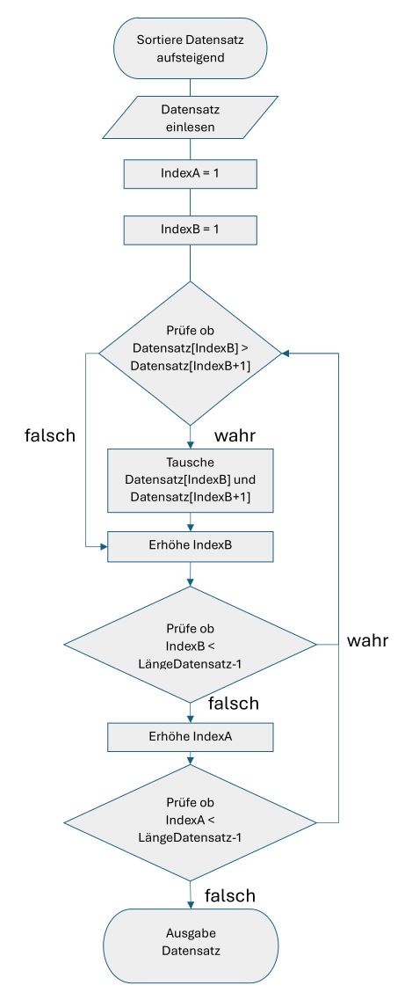
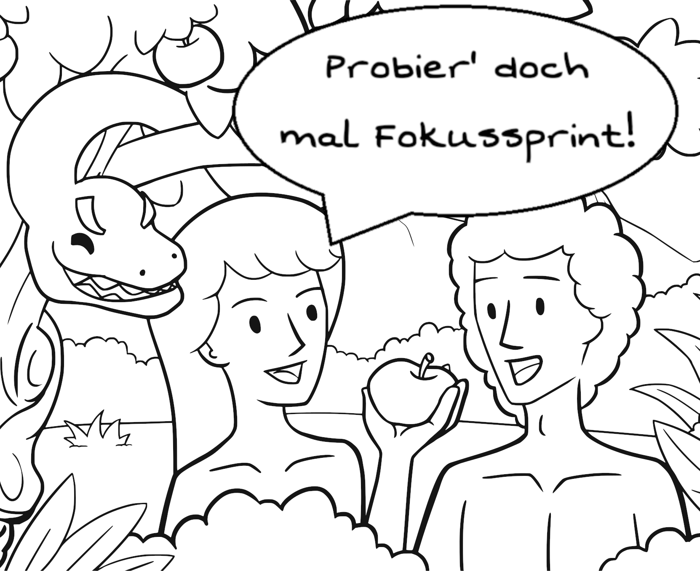
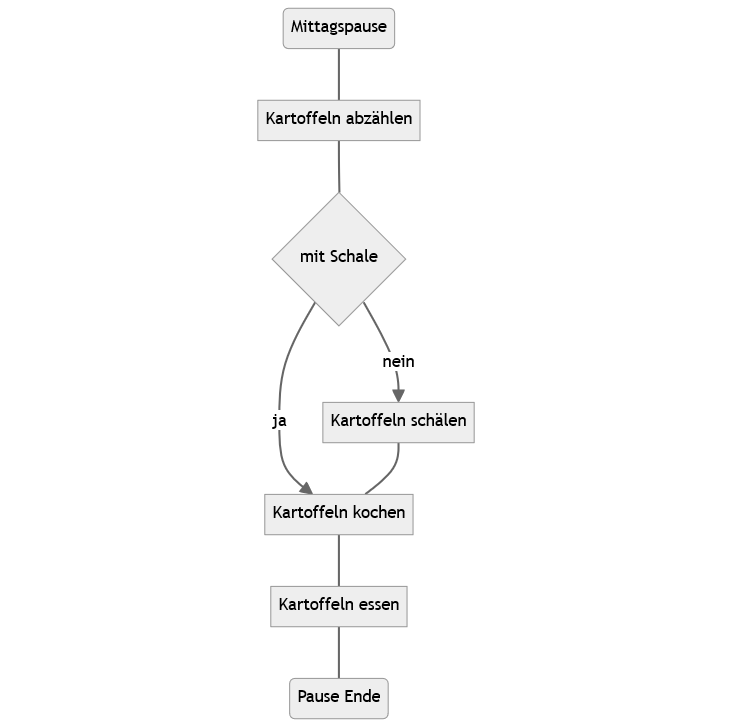
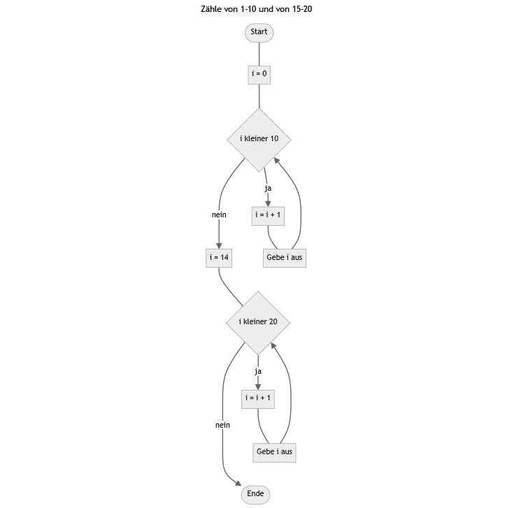

---
# Metadaten / meta data
title: "Werkzeugbaustein Pseudocode"
author:
  - Lukas Arnold
  - Simone Arnold
  - Florian Bagemihl
  - Matthias Baitsch
  - Marc Fehr
  - Franca Hollmann
  - Maik Poetzsch
  - Sebastian Seipel
date: today # "2024-03-05" Jahr-Monat-Tag / year-month-day

## Spracheinstellungen / language settings
lang: de
language:
  de:
    crossref-imp-title: "Definition"
    crossref-imp-prefix: "Definition"
    crossref-lst-title: "Code-Block"
    crossref-lst-prefix: "Code-Block"
    crossref-nte-title: "Beispiel"
    crossref-nte-prefix: "Beispiel"
    crossref-tip-title: "Tipp"
    crossref-tip-prefix: "Tipp"
    crossref-wrn-title: "Hinweis"
    crossref-wrn-prefix: "Hinweis"
    
# Dokumenteneinstellungen / document options
engine: knitr # jupyter kann den CSS-Code für Blocksatz nicht verarbeiten

mermaid: 
  theme: neutral # default hat zu dunkle subgraphs

## Formatoption / formating options
format:
  html:
    ## Logo im Browsertab
    ### Logo in Quarto Books
    favicon: "skript/00-bilder/favicon_bcd_new.svg"
    
    ### Logo in HTML
    include-in-header:
      text: |
        <link rel="shortcut icon" href="skript/00-bilder/favicon_bcd_new.svg" />
        <link rel="icon" type="image/x-icon" href="logo.ico">
    
    default-image-extension: svg
    code-copy: true # hover is default
  pdf:
    cite-method: biblatex
    biblio-title: Quellen
    default-image-extension: pdf # Vektorgrafiken werden als PDF eingebunden / vector grafics are embedded as PDF
    
## Inhaltsverzeichnis / table of contents
toc: true
toc-title:  |
  Werkzeugbaustein Pseudocode 

  
number-sections: true
number-depth: 2

## Bibliographie / bibliography
bibliography: bibliography.bib
biblio-style: authoryear

## Objekteinstellungen / object options
cap-location: bottom
fig-align: center

### Grafiken von R oder Matplotlib / Figures from R or Matplotlib
# Empfehlung von / suggestion from https://r4ds.hadley.nz/quarto#sec-figures
fig-width: 6
fig-asp: 0.618
---

&nbsp;

&nbsp;

::: {.border #Lizenz}

<!-- Die Lizenz wird manuell in einer Div erstellt, um Vorgaben für OER hinsichtlich Position und Format zu entsprechen. (licence key im YAML-Header funktioniert in PDF nicht.) -->

:::: {layout="[20, 80]"}
{fig-alt="Symbol des Lizenzhinweises Creative Commons BY"} <!-- Grafik ohne Titel und Dateiendung einbinden -->  

Bausteine Computergestützter Datenanalyse von Lukas Arnold, Simone Arnold, Florian Bagemihl, Matthias Baitsch, Marc Fehr, Franca Hollmann, Maik Poetzsch und Sebastian Seipel. Werkzeugbaustein Pseudocode von Maik Poetzsch ist lizensiert unter [CC BY 4.0](https://creativecommons.org/licenses/by/4.0/deed.de). Das Werk ist abrufbar auf [GitHub](https://github.com/bausteine-der-datenanalyse). Ausgenommen von der Lizenz sind alle Logos und anders gekennzeichneten Inhalte. 2025

::::

Zitiervorschlag

Arnold, Lukas, Simone Arnold, Florian Bagemihl, Matthias Baitsch, Marc Fehr, Franca Hollmann, Maik Poetzsch, und Sebastian Seipel. 2025. „Bausteine Computergestützter Datenanalyse. Werkzeugbaustein Pseudocode“. <https://github.com/bausteine-der-datenanalyse/w-pseudocode>.


BibTeX-Vorlage

```
@misc{BCD-pseudocode-2025,
 title={Bausteine Computergestützter Datenanalyse. Werkzeugbaustein Pseudocode},
 author={Arnold, Lukas and Arnold, Simone and Bagemihl, Florian and Baitsch, Matthias and Fehr, Marc and Hollmann, Franca and Poetzsch, Maik and Seipel, Sebastian},
 year={2025},
 url={https://github.com/bausteine-der-datenanalyse/w-pseudocode}} 
```

:::







# Pseudocode

<div style="position: relative; width: 100%; aspect-ratio: 16 / 9;">
  <iframe src="https://av.tib.eu/player/71642" allowfullscreen style="position: absolute; top: 0; left: 0; width: 100%; height: 100%;"></iframe>
</div>

&nbsp;

## What Is Pseudocode?

{fig-alt="Decorative image of a group of four people sitting at a set dining table. A man has stood up to make a toast." width="50%"}

::: {.border}
Toast Dining Eating by OpenClipart-Vectors is licensed under the [Pixabay Content License](https://pixabay.com/service/license-summary/). The work is available on [Pixabay](https://pixabay.com/vectors/toast-dining-eating-event-festive-153723/). 2013
:::

&nbsp;

Think of preparing a festive meal. You have found a recipe online, bought all the ingredients from the ingredient list, and start cooking according to the preparation time stated so that everything is ready before your guests arrive. Sounds good, right? Well, this approach often results in hungry guests, because recipes are rarely complete step-by-step instructions but instead require some preparatory work:

* Sometimes ingredients are missing from the ingredient list; sometimes an ingredient that needs to be purchased is not mentioned in the recipe steps and is left unused at the end. In step four, the dough has already been resting in the refrigerator for two hours and the oven has already been preheated to 250 degrees.
A complete task description requires preparation: only those who know all dependencies will finish on time.

* In the kitchen, a specialized technical language is used: Do you know what blanching means, why even clean vegetables should be trimmed, when pasta is al dente, or whether the sauce should already be flaming before it is deglazed? If not, some translation work into a language you understand is required first.

* If you do not have a knife, you cannot cut bread: ingredients are not everything; the right tools are also required for a successful dish. Do you have everything in your kitchen that you need for preparation?

In short: you need your own plan—not only when cooking, but also when performing computer-based data analysis. Data analysis is rarely linear. Instead, steps for organizing, visualizing, analyzing, and further processing data alternate. A wide variety of programs with their own syntax are available for this purpose. Or is a self-written function better suited? Data are often available in different formats and must be transformed for use with specialized programs.  
These are typical challenges of data analysis that can be addressed through good planning. Pseudocode helps you with this planning.

Pseudocode describes a program and computer science concepts in an easily understandable, everyday language. Developing pseudocode can be used both as a creativity technique and as a template for the structured solution of tasks. Pseudocode allows you to initially focus on the conceptual solution of a task and the planning of the program structure. This can be useful for simplifying development by dividing the program into intermediate steps, identifying required programs, packages, and methods, or estimating the workload.

Pseudocode is also a tool for communicating about a program with others, for example when discussing a problem in code. Because pseudocode does not require knowledge of a specific programming language, it is intuitively understandable. To support the communicative function of pseudocode, it can, for example, be visualized as a flowchart.

:::{#imp-Pseudocode .callout-important}
## Pseudocode
Pseudocode describes a solution approach for computational tasks using a formalized everyday language instead of the expressions and syntax of a programming language. The prefix *pseudo* comes from Greek and means false or only appearing to be something. Pseudocode is “false” program code that is formed using natural language. [@Pseudocode-was-ist]  
Pseudocode is also a means of communication for discussing computational problems and their solutions with others (e.g., fellow students, supervisors).
:::

## Pseudocode From Simple to Detailed
The form and level of detail with which you formulate pseudocode depend on your level of knowledge and your goal: for structuring your program into sequential intermediate steps and identifying dependencies, a simple list of work steps is sufficient. For developing an algorithm and identifying required methods (e.g., loops) and tools (e.g., specialized packages), it will be necessary to describe program instructions in more detail. A detailed representation helps you, for example, to identify recurring work steps that can be outsourced into a function. For presenting your program at a scientific conference or documenting it in a user manual, a flowchart may be appropriate.

::: {.panel-tabset}

## simple
Program instruction with a descriptive name

`SortAscending`

## intermediate
Instruction block in everyday language

```
  SortAscending
    IterateDataset (DatasetLength - 1) times # Number of repetitions
      From beginning to (DatasetLength - 1) # Pairwise comparisons
        Compare value and successor
        IF value greater than successor THEN
          Swap value and successor
    OutputDataset
```

## Detailed
Block of instructions in the style and using the terminology of programming

```
  SortAscending  
    IF DatasetLength > 1 THEN
      FROM Dataset[IndexA = 1] TO Dataset[IndexA = DatasetLength - 1] DO # Number of loop iterations
        FROM Dataset[IndexB = 1] TO Dataset[IndexB = DatasetLength - 1] DO # Pairwise comparisons
          IF Dataset[IndexB] > Dataset[IndexB + 1] THEN
            Swap(Dataset[IndexB], Dataset[IndexB + 1])
              Write(Dataset[IndexB], to = TempStorage)
              Write(Dataset[IndexB + 1], to = Dataset[IndexB])
              Write(TempStorage, to = Dataset[IndexB + 1])
          IF IndexB < DatasetLength - 1 THEN
            Increment IndexB
      IF IndexA < DatasetLength - 1 THEN
        Increment IndexA
    OutputDataset
```

## Flowchart

{fig-alt="A flowchart that illustrates the program flow from the tab in detail." width="50%"}

:::: {.border}
Flowchart by Marc Sönnecken and Maik Poetzsch
::::
:::

&nbsp;

# Writing Pseudocode
The following schema helps you develop ideas, describe a program, and visualize the program flow. Pseudocode allows you to describe your program as well as the required tools and methods in a way that is understandable to yourself and others. How you write pseudocode is an individual matter, as there are only a few rules. Pseudocode primarily helps you develop a solution approach for a given task. Pseudocode is considered ‘correctly’ written if it helps you:

* focus your thoughts,

* describe a task in a way that is understandable to you,

* break the task into clearly defined sub-tasks,

* develop a solution procedure (algorithm) for the sub-tasks,

* identify required methods and tools,

* describe your solution procedures as a program of consecutive steps,

* estimate the time required for implementation, and

* communicate your program to others.

## Exercises
For this module, two exercises are available. They are designed to be approachable for students without prior knowledge in data analysis and illustrate aspects of program development. However, it is often best to work on your own project. In the "Own Project" tab, you can formulate your own task.

::: {.panel-tabset}

## Overview

* No prior data analysis knowledge: Baking a Sweet Braid  
Learning goals: Break a task into consecutive steps, fully describe each step, identify dependencies and prerequisites (required tools, estimate time).  

* With prior data analysis knowledge: Vitamin C in Guinea Pigs  
Learning goals: Describe data analysis using pseudocode.  

## Own Project
Here you can note down your task or project goal. Please note that your text will not be saved.

<textarea id=“own-project” name=“own-project” rows="4" cols="50"></textarea>

## Baking a Sweet Braid
Your friend Lisa sends you a recipe she found online. She writes that she can arrive an hour earlier than planned tomorrow to bake together with you – working together will be faster than the 65 minutes stated in the recipe. Lisa also asks if she should bring any ingredients.

**How would you respond to Lisa? Model the baking process.**

:::: {.border}

The following recipe was created by Anna-Lena and is available at <https://www.einfachbacken.de/rezepte/hefezopf>.

***Tender Sweet Braid***  
Preparation time: 40 min  
Baking time: 25 min

| Ingredients |  |
|---|---|
| 250 ml | milk |
| 475 g | wheat flour (Type 405) |
| 60 g | sugar |
| ½ cube | fresh yeast (approx. 21 g) |
| 50 g | soft butter (room temperature) |
| 1 pinch | salt |
| 1 | egg (size M) |
|   | some milk for brushing 
|   | some pearl sugar for sprinkling
|   | some flour for dough handling |

&nbsp;

**Step 1**

**250 ml** milk, **475 g** wheat flour (Type 405), **1 pinch** sugar, **½ cube** fresh yeast (approx. 21 g)

Warm the milk until lukewarm. Sift the flour into a bowl. Make a well in the flour and crumble the yeast into the well. Mix 3 tbsp of the lukewarm milk with 1 pinch of sugar and pour over the yeast in the well. Stir the yeast-milk mixture lightly with a spoon (do not knead the flour yet). Cover the bowl with a kitchen towel and let it rest in a warm place for about 15 minutes.

**Step 2**

**1** egg (size M), **60 g** sugar, **1 pinch** salt, **50 g** soft butter (room temperature)

Add the egg, remaining milk, remaining sugar, and salt to the bowl and knead together with the yeast mixture and flour for 3 min on low speed, then approx. 5 min on high speed using the mixer hooks. Gradually knead in the butter in pieces. To ensure the dough rises well, knead it vigorously for at least 5 min. Otherwise, the dough may collapse later or be sticky!

**Step 3**

some flour for dough handling

Cover the bowl with the dough again with a kitchen towel and let it rest in a warm place for another 60 min. Then place the dough on a floured surface and divide it into three parts. Roll each dough piece into a long sausage, about 40 cm long. Braid the dough strands. Twist the ends together and tuck them under the braid to create a neat finish. Place the braid on a baking sheet lined with parchment paper and cover with a kitchen towel. Let it rest for another 45 min.

**Step 4**

some milk for brushing, some pearl sugar for sprinkling

Meanwhile, preheat the oven to **200°C top/bottom heat (180°C fan)**. Brush the braid with some milk and sprinkle with pearl sugar. Bake the braid in the preheated oven for **about 15-20 minutes** until lightly browned. Let it cool completely. The braid can also be frozen.

::::

## Vitamin C in Guinea Pigs
In a group of 60 guinea pigs, the length of odontoblasts (tooth-forming cells) was measured in microns (**len**). The animals had previously been given Vitamin C as ascorbic acid (VC) or orange juice (VC) (**supp**). The guinea pigs received doses of 0.5, 1, or 2 milligrams of Vitamin C per day (**dose**). [@Crampton.1947]

**What effect does Vitamin C have on tooth growth in guinea pigs? Describe your approach using pseudocode or a flowchart to determine the effect of supplement type and dose.**

```{r}
#| output: FALSE
#| echo: FALSE
ToothGrowth[c(1, 11, 21, 31, 41, 51), ]
```

| \# | len  | supp | dose |
|----|------|------|------|
| 1  | 4.2  | VC   | 0.5  |
| 11 | 16.5 | VC   | 1    |
| 21 | 23.6 | VC   | 2    |
| 31 | 15.2 | OJ   | 0.5  |
| 41 | 19.7 | OJ   | 1    |
| 51 | 25.5 | OJ   | 2    |

&nbsp;

If you want to view the complete dataset, you can access it in R with `ToothGrowth` or download the dataset here: [ToothGrowth.csv](https://vincentarelbundock.github.io/Rdatasets/csv/datasets/ToothGrowth.csv)

:::

## Using EVA for a Focus Sprint
{fig-alt="Decorative graphic: The biblical Eve hands Adam an apple in paradise. She says: Try a Focus Sprint!" width="50%"}

::: {.border}
Adam Bible Nature by CCXpistiavos is licensed under the [Pixabay Content License](https://pixabay.com/service/license-summary/). Available on [Pixabay](https://pixabay.com/vectors/adam-bible-bible-pics-2061819/). The speech bubble has been added.
:::

&nbsp;

Sometimes getting started is the hardest part. The first step in program development is idea collection: What exactly should be done, which steps are required, what can already be done, and what still needs preparation or research? **If you already have a clear idea of the solution, you can skip this step.**

The **Focus Sprint** (Scheuermann 2016) is a fast writing exercise to get started on writing about a specific topic. The exercise can be used as a creativity technique for starting a topic or as a thinking aid during work. The goal is to write quickly, which allows you to get close to your inner voice and let creativity flow. [@Scheuermann2016, 74, 78]

The Focus Sprint is conducted in two steps: The first step is a five-minute writing phase. Write the task or problem you want to explore on paper or a computer. You can use a keyword or formulate a specific question. Set a timer for 5 minutes and start writing quickly on your prepared sheet. There is only one rule: If you notice your thoughts drifting off-topic, return to the topic, for example, by rewriting the task where you are currently writing. [@Scheuermann2016, 78]  

### Focus Sprint {-}

**You can perform your Focus Sprint in this text field. Please note that your text will not be saved. So: 3, 2, 1 – start writing in your own words!**

<textarea id="focussprint-textarea" name="focussprint-textarea" rows="4" cols="50"></textarea> 

&nbsp;

The second step is evaluation. Read through your Focus Sprint and highlight what seems important. Can you identify intermediate steps? If so, highlight them and add notes, comments, or questions. [cf. @Scheuermann2016, 78]

::: {#tip-intermediate-steps .callout-tip collapse="true"}
# Identifying Intermediate Steps

Intermediate steps break a complex task into manageable work packages that each perform a specific function in the program flow (e.g., sorting data) or produce a specific output (e.g., a chart). An intermediate step is a subroutine, and creating intermediate steps helps break a task into subtasks and understand which steps must be executed in a subroutine to solve the subtask.

The main purpose of creating intermediate steps is to reduce complexity. A subroutine developed for a defined subtask can be easily tested to identify and fix errors. Subroutines can also be reused in the program flow, e.g., to simplify the solution of another, more complex subtask.

When defining intermediate steps, other criteria can also be useful, such as the location of data processing (e.g., at the measuring site, on a workstation, in a data center) or the tools used (e.g., microcontroller, Python, C++, manual data processing).

:::: {#tip-exercise-steps .callout-tip collapse="true"}
# Possible Intermediate Steps for Exercises

Baking a braided yeast bread

  * By function: Prepare ingredients, process ingredients, bake

  * By output: Prepare milk mixture, prepare yeast mixture, prepare raw dough, shape dough braid, bake braid

Vitamin C for guinea pigs

  * By function: Create subsets, analyze dataset, visualize dataset, create flowchart

  * By output: Tabulated mean comparison, boxplot for all subgroups, Mermaid flowchart

::::
:::

The **EVA principle** helps you fully describe intermediate steps. EVA is a basic pattern in computer-based data processing: **E**ntry, **P**rocessing, **O**utput. These steps follow in order: first data is collected, then processed, and finally results are output.

* Entry: What data is provided as input? What format is it in?

* Processing: What steps must be performed to achieve the described output?

* Output: What result should the data processing produce? What format should the output be in?

To conclude, summarize your focus sprint in one core sentence that highlights what is most important to you. This can be a statement, but also an open question that you would like to pursue further. Mark this core sentence additionally. [@Scheuermann2016, 79]

With this, you have completed the first step toward formulating a complete program description! If you wish, you can deepen your thoughts on an open question or an intermediate step with another focus sprint. Otherwise, the next step follows now.


## Program Description in Pseudocode
You now have an idea of your solution path, its intermediate steps, and their sequence. The next step is formalizing your program using pseudocode. Program instructions are described in everyday language but with programming style and terminology. This means:

1. Assign meaningful names to instructions. In data analysis, common instructions are:

    * Import data (`import`), e.g., FetchDataFromLocation

    * Organize data (`tidy`), e.g., SortAscending

    * Transform data (`transform`), e.g., ComputeAverage

    * Visualize data (`visualise`), e.g., GenerateHistogram

    * Model data (`model`), e.g., CreateLinearModel

    * Export data (`export`), e.g., SavePlot

    [cf. @R-for-Data-Science, Chapter Whole Game]

2. to document the program flow by

    * writing consecutive program statements one below the other,

    * making blocks of program statements recognizable through indentation and/or bracketing, and

    * grouping related program statements into clearly separated intermediate steps.

3. to separate program statements from explanatory parts by using comments, by

    * marking comments with special symbols, for example `// comment`, `# comment`, `%% comment`, or `/* comment */`, and

    * placing them in front of individual work steps (e.g., short descriptions of intermediate steps according to the EVA model) and/or using them within a line.


4. Expressing complex program instructions using computer science terminology, where appropriate in accordance with the concepts and syntax of the programming language you have chosen. This includes:

**Conditional statements:** Conditional statements make the execution of program instructions dependent on one or more conditions.

  * IF A (less than, less than or equal to, exactly equal to, greater than, greater than or equal to, not equal to) B, THEN C, ELSE D

  * IF A B1 AND B2, THEN C

  * IF A B1 OR B2, THEN C

**Loops:** Loops repeat program instructions as long as the entry condition holds or until the termination condition is met.

  * WHILE A, DO C
  
  * FROM A TO B, DO C  

**Functions:** Functions bundle program instructions so that parts of a program can be reused multiple times. Functions are a form of subprograms.

  * FunctionDoXY(Argument 1, Argument 2, ...)  
    Instruction1  
    Instruction2  
    ...


::: {#nte-example-pseudocode .callout-note collapse="true"}
# Program Description in Pseudocode

```
# Input: one-dimensional, ordinal dataset
# Processing: check if dataset contains at least two values
## if not: error message
## if yes: ascending sort using bubble sort with control structure for the outer loop
# Output: ascending sorted dataset

  SortAscending(Dataset)
    IF DatasetLength > 1 THEN

      # outer loop
      do_work = TRUE # control structure for the outer loop
      IF do_work == TRUE THEN

        FROM Dataset[IndexA = 1] TO Dataset[DatasetLength - 1] DO
          do_work = FALSE

          # inner loop for pairwise comparisons
          FROM Dataset[IndexB = 1] TO Dataset[DatasetLength - 1] DO
            IF Dataset[IndexB] > Dataset[IndexB + 1] THEN
              Swap(Dataset[IndexB], Dataset[IndexB + 1])
                Write(Dataset[IndexB], to = TempStorage)
                Write(Dataset[IndexB + 1], to = Dataset[IndexB])
                Write(TempStorage, to = Dataset[IndexB + 1])
              do_work = TRUE # mark if a swap occurred
            IF IndexB < DatasetLength - 1 THEN
              Increment IndexB
          
          IF IndexA < DatasetLength - 1 THEN
            Increment IndexA

      OutputDataset
    ELSE
      Report("The dataset must contain at least two elements!")

```


*Note: Manually incrementing the counter is usually not required in programming languages and is used here only for better clarity.*

:::

By formalizing your program in pseudocode, you have developed an intuitively understandable, complete program description. The next step is to visualize your program graphically.

&nbsp;

::: {.panel-tabset}

## Counting Exercise
**Describe a program in pseudocode that counts from 1 to 10 and from 15 to 20.**

You can write your pseudocode in this text field. Please note that your text will not be saved.

<textarea id="exercise-area2" name="exercise-area2" rows="4" cols="50"></textarea> 

## Sample Pseudocode Solution

```
i = 0
WHILE i is smaller then 10 DO
  increase i by 1
  output i
i = 14
WHILE i is smaller then 20 DO
  increase i by 1
  output i
```

:::

### Karel The Robot
If you want to practice the application of computer science concepts such as conditionals or loops, [Karel The Robot](https://github.com/fredoverflow/karel) is well worth a look. The program introduces the application of computer science control structures using its own pseudocode language.

An introduction to the program, along with instructions for installation and usage, can be found on the GitHub page linked in the previous paragraph or on the YouTube channel of Medienberatung Niedersachsen:

::: {.border}


Learning to program with Karel by Medienberatung Niedersachsen is licensed under [CC-BY](https://creativecommons.org/licenses/by/4.0/). The work is available on [YouTube](https://www.youtube.com/watch?v=vD8RN_WbvLo). 2022
:::


## Visualizing Program Flow
{fig-alt="A person speaking through a megaphone" width="50%"}

::: {.border}
Lead 1 by CocoMaterial is licensed under [CC0 1.0](https://creativecommons.org/publicdomain/zero/1.0/). The work is available on [CocoMaterial](https://cocomaterial.com/results?q=megaphone&vectorId=65).
:::

&nbsp;

A clear graphical representation gives pseudocode even more clarity and thus particularly supports communication with others. The graphical representation of a program is called a flowchart. The symbols used for a flowchart are standardized in [@DIN-66001-1983]. The shapes are also referred to as nodes, and the connections as edges.

<!-- For technical reasons, these are rendered graphics --> 
<!-- see mermaid-code.txt -->

::: {layout="[30, 70]"}

{fig-alt="Rounded rectangle labeled Start / Stop"}

Rounded rectangle (Number 6.4.1)
: Interface to the environment that indicates the beginning and end of a sequence and, for example, signals the origin or destination of data.

{fig-alt="Rectangle labeled Processing"}

Rectangle (Number 6.1.1)
: Processing including input/output

{fig-alt="Diamond with two arrows labeled true and false leading to two rectangles, Instruction 1 and Instruction 2."}

Diamond (Number 6.1.2)
: Branching / decision

{fig-alt="Subroutine Make coffee consisting of a rectangle with double vertical lines 'Make coffee' and a framed sequence of connected rectangles 'Insert filter'–'Add coffee grounds'–'Add water'–'Turn on coffee machine'. The framed sequence is titled Make coffee."}

Rectangle with double vertical lines (Number 7.2.4)
: Reference to a program documented elsewhere

{fig-alt="Flowchart showing the use of labeled arrows and lines of different lengths."}

Connection (Number 6.3.1)
: Process chains are connected with lines or arrows. Connections are oriented from left to right or from top to bottom; deviations must be indicated with arrowheads.
: If multiple outputs are associated with conditions, these must be identified by labels on the connecting lines.
: Multiple connections to a symbol can be merged into one connection. However, crossing connection lines should be avoided. These do not represent a merge. (*Note: Schemdraw is recommended for displaying merged connections.*)

:::

[@DIN-66001-1983]

::: {#wrn-DIN66001 .callout-warning appearance="simple" collapse="true"}
# Representation of Data According to DIN 66001
DIN 66001 also defines symbols for representing data. However, the standard specifies for flowcharts: "Data are not represented. See example in section A.2." [@DIN-66001-1983, p. 2]. Nevertheless, specific types of data are shown in example A.2, such as manually or machine-processed data [@DIN-66001-1983, pp. 13–14].

However, the symbols for specific data types defined in numbers 6.2.2 to 6.2.10 are not fully available in all diagram tools. This affects:

  * [Graphviz](https://graphviz.org/doc/info/shapes.html) (e.g., machine-processed data according to number 6.2.2)

  * [Mermaid](https://mermaid.js.org/syntax/flowchart.html#node-shapes) (e.g., machine-processed data according to number 6.2.2)

  * Office software suite LibreOffice (e.g., manually processed data according to number 6.2.3)

In the representation of flowcharts, the use of symbol No. 6.2.1 (general data) is common practice.


:::: {layout="[30, 70]"}

  

Data (Number 6.2.1)
: Representation for data or data carriers in general

::::

<!-- Note: For technical reasons, this is a rendered graphic (Quarto issue #9677). -->

:::

### Tools for Creating Flowcharts {-}
Flowcharts can be created in various ways:

  * with pen and paper,

  * with office software suites such as LibreOffice,

  * with visualization programs such as [Graphviz](https://graphviz.org/) or [Mermaid](https://mermaid.js.org/),

  * with specialized packages such as [DiagrammeR](https://cran.r-project.org/web/packages/DiagrammeR/index.html) or [Schemdraw](https://schemdraw.readthedocs.io/en/latest/elements/flow.html).

The range of functions and syntax differ, and each tool has its own strengths. Mermaid, Graphviz, and Schemdraw are declarative drawing tools with which flowcharts (and other graphics) can be written and rendered visually. Mermaid has a simple, intuitive syntax. Graphviz allows more design options (but requires a local system installation when used with Python). The Python module Schemdraw supports a syntax similar to Python code and provides easy access to DIN-compliant nodes and edges.

::: {#nte-flowcharts .callout-note collapse="true" title="Creating Flowcharts in Python and R"}

:::: {.panel-tabset}

## Code Example Python

```{python}
#| eval: false
#| echo: true
#| output: false

# Flowchart with Schemdraw and Graphviz in Python

## Schemdraw
import subprocess
subprocess.call(['pip', 'install', 'schemdraw'])
import schemdraw

from schemdraw.flow import *

with schemdraw.Drawing() as drawing:
    # continuous process in correct order from start to end
    drawing += Start().label("Lunch Break")
    drawing += Line().down()
    drawing += Box().label("Count potatoes")
    drawing += Line().down()
    drawing += (with_peel := Decision(S="Yes", E="No").label("With peel?"))
    drawing += Arrow().at(with_peel.S)
    drawing += (cook := Box().label("Cook potatoes"))
    drawing += Line().down()
    drawing += Box().label("Eat potatoes")
    drawing += Line().down()
    drawing += Start().label("Break End")

    # alternative branch of the decision
    drawing += Arrow().right().at(with_peel.E)
    drawing += (peel := Box().label("Peel potatoes"))
    drawing += Wire("|-", arrow="->").at(peel.S).to(cook.E)  # .S + .E (or other directions) must be set; |- first defines a vertical, right-angled edge
    
    drawing.draw()
    # drawing.save("Potatoes.svg")

## Graphviz
## requires a local installation of Graphviz https://graphviz.org/download/

import subprocess
subprocess.call(['pip', 'install', 'graphviz'])  # installs the graphviz module
import graphviz

dot = graphviz.Digraph(name="Potatoes")

### Start / End
dot.node(name="Lunch Break", shape="Mrecord")
dot.node(name="Break End", shape="Mrecord")

### Instructions
dot.node(name="Count potatoes", shape="box")
dot.node(name="Peel potatoes", shape="box")
dot.node(name="Cook potatoes", shape="box")
dot.node(name="Eat potatoes", shape="box")

### Decision
dot.node(name="with peel", shape="diamond")
    
### Edges
dot.edge("Lunch Break", "Count potatoes", arrowhead="none")
dot.edge("Count potatoes", "with peel", arrowhead="none")
dot.edge("with peel", "Cook potatoes", label="Yes")
dot.edge("with peel", "Peel potatoes", label="No")
dot.edge("Peel potatoes", "Cook potatoes", arrowhead="none")
dot.edge("Cook potatoes", "Eat potatoes", arrowhead="none")
dot.edge("Eat potatoes", "Break End", arrowhead="none")

dot.render("Potatoes.gv", cleanup=True, view=True)

```


## Schemdraw in Python

```{python}
#| eval: false
#| echo: false
#| output: false

import subprocess
subprocess.call(['pip', 'install', 'schemdraw'])
```

```{python}
#| eval: false
#| echo: false
#| label: python-schemdraw
#| fig-cap: "Flowchart with Schemdraw"
#| fig-alt: "A flowchart created with Schemdraw, showing how to cook potatoes for the lunch break with or without skin."

import schemdraw
from schemdraw.flow import *

with schemdraw.Drawing(show=False) as d:
    # continuous process in correct order from start to finish
    d += Start().label("Lunch break")
    d += Line().down()
    d += Box().label("Count potatoes")
    d += Line().down()
    d += (with_skin := Decision(S="Yes", E="No").label("With skin?"))  # S = South, E = East
    d += Arrow().at(with_skin.S)
    d += (cook := Box().label("Cook potatoes"))
    d += Line().down()
    d += Box().label("Eat potatoes")
    d += Line().down()
    d += Start().label("Break ends")

    # alternative branch of the decision
    d += Arrow().right().at(with_skin.E)
    d += (peel := Box().label("Peel potatoes"))
    d += Wire("|-", arrow="->").at(peel.S).to(cook.E)  # .S + .E (or other directions) must be set; |- first defines a vertical, right-angled edge

    d.draw(show=False)
    # d.save("potatoes.svg")
```

{fig-alt="A flowchart created with Schemdraw showing how to cook potatoes with or without skin during the lunch break."}

*Note: For technical reasons, the graphic was included as an image.*

## R code example

```
# Flowchart with DiagrammeR in R

install.packages("DiagrammeR")
library("DiagrammeR")

## Mermaid
DiagrammeR::mermaid("
  graph TD
    0(Lunch break)
    A[Count potatoes]
    B{with skin}
    D[Cook potatoes]
    E[Eat potatoes]
    S[Peel potatoes]
    Z(Break ends)
    
    0---A
    A---B
    B-->|yes|D
    B-->|no|S
    S---D
    D---E
    E---Z
")

## Graphviz
DiagrammeR::grViz("

  graph Potatoes {
  
  # defining nodes
  node [shape = Mrecord]
  
    Lunch_break; Break_ends
  
  node [shape = box]
  
    Count_potatoes
    Peel_potatoes
    Cook_potatoes
    Eat_potatoes
    
  node[shape = diamond]
  
    with_skin
    
  # defining edges
    Lunch_break -- Count_potatoes
    Count_potatoes -- with_skin
      with_skin -- Cook_potatoes[dir = forward label=yes]
      with_skin -- Peel_potatoes[dir = forward label=no]
        Peel_potatoes -- Cook_potatoes
    Cook_potatoes -- Eat_potatoes
    Eat_potatoes -- Break_ends
  }
")
```

## Mermaid in R
<!-- The Mermaid code runs in Quarto, but not in HTML (causes Mermaid engine to crash). HTML comments are parsed by Mermaid. Therefore, include as an image. https://github.com/quarto-dev/quarto-cli/issues/9693 -->

<!-- .svg fails to render with arrow heads -->



<!-- Note: For technical reasons, this is a rendered image (Quarto issue #9693). -->
::::

:::
&nbsp;

::: {.panel-tabset}

## Exercise: Counting
**Create a flowchart for a program that counts from 1 to 10 and from 15 to 20.**

## Sample Solution Pseudocode

```
i = 0
WHILE i is smaller then 10 DO
  increase i by 1
  output i
i = 14
WHILE i is smaller then 20 DO
  increase i by 1
  output i
```

## Sample solution Mermaid
```{.raw}
---
title: Count from 1-10 and from 15-20
---
flowchart TD
Start([Start])
initialize1[i = 0]
initialize2[i = 14]
Loop1{i less than 10}
Loop2{i less than 20}
Increment1[i = i + 1]
Increment2[i = i + 1]
Output1[Print i]
Output2[Print i]
End([End])

Start --- initialize1
initialize1 --- Loop1
    
    Loop1 -->|no| initialize2 --- Loop2
        Loop2 -->|yes| Increment2 --- Output2 --> Loop2
        Loop2 -->|no| End

    Loop1 -->|yes| Increment1 --- Output1 --> Loop1

%% invisible connections for positioning
    Output1 ~~~ Loop2
    Output2 ~~~ End
```


## Sample Solution Flowchart

<!-- .svg fails to render with arrow heads -->

{fig-alt="The flowchart corresponding to the Mermaid code from the previous panel."}

<!-- Note: For technical reasons, this is a rendered graphic (Quarto issue #9693). -->

:::

# Sample Solutions

:::{#tip-BraidedBread .callout-tip collapse="true"}
## Baking Braided Bread
Preparing the braided bread takes at least three hours. The dough (or yeast mixture) needs to rise over several steps for a total of 120 minutes and then cool after baking. Due to the long waiting times, one person can complete all steps, and having a second person work in parallel saves very little time. Lisa may, of course, come an hour earlier, but then the dough is either resting for the final time, baking in the oven, or cooling. She does not need to bring ingredients, as the ingredient list is complete.

```
# Step 1 - approx. 25 minutes
## Input: 250 ml milk, 475 g wheat flour, 1 pinch of sugar, ½ cube of yeast
## Tools: bowl, sieve, pot, spoon, kitchen towel  
## Process: Dissolve yeast in sweetened milk
## Output: Yeast mixture, flour

PrepareYeastMixture
  SiftFlour # use sieve
  AddFlour        
  MakeWell # create a well in the flour  
  CrumbleYeast  
  AddYeast  
  PrepareMilk # use pot
    **WHILE** Milk < lukewarm **DO**  
      HeatMilk  
    AddSugar
    Stir # mix milk and sugar with spoon  
  AddMilk  
  Stir # mix yeast and milk mixture with spoon  
  DoughRises(Time = 15 minutes)  
    CoverBowl # use kitchen towel  
    KeepWarm

# Step 2 - approx. 75 minutes
## Input: yeast mixture, flour, 1 egg, 60 g sugar, 1 pinch salt, 50 g butter  
## Tools: bowl, mixer, knife, kitchen towel
## Process: Add egg, milk, salt, butter and knead  
## Output: raw dough
    
PrepareDough  
  DiceButter # use knife  
    # Output: n butter cubes
  **WHILE** DoughRises **DO**
    Wait  
  AddEgg  
  AddMilk  
  AddSugar  
  AddSalt  
  Knead(Time = 3 min, Speed = low) # use mixer hook  
  Knead(Time = 5 min, Speed = high) # use mixer hook  
  AddButter  
    **WHILE** n > 0 **DO**  
      Knead(Speed = high)  
      AddButterCube  
      n = n - 1
    Knead(Time = 5 min, Speed = high) # use mixer hook
  DoughRises(Time = 60 minutes)  
    CoverBowl # use kitchen towel  
    KeepWarm

# Step 3 - approx. 55 minutes
## Input: raw dough, some flour
## Process: Shape raw dough into braided loaf
## Tools: baking tray, parchment paper, kitchen towel
## Output: braided loaf

ShapeBraid  
  PlaceParchmentOnTray  
  FlourWorkSurface  
  PlaceDoughOnSurface  
  DivideDough(Pieces = 3)  
    # Output = n dough pieces  
  RollDough  
    **WHILE** n > 0 **DO**  
      RollPiece(Length = 40 cm)  
      n = n - 1  
  CreateBraid  
    BraidRolls  
    TwistEnds  
  PlaceBraidOnParchment  
  DoughRises(Time = 45 minutes)  
    CoverBraid # use kitchen towel 
    KeepWarm  

# Step 4 - approx. 40 minutes
## Input: braided loaf, some milk, some pearl sugar
## Tools: brush, oven
## Process: Brush loaf, sprinkle, and bake
## Output: baked yeast braid

BakeBraid  
  PreheatOven  
    **IF** ConvectionAvailable **THEN**   
      Mode = Convection  
      Temperature = 180 C  
    **ELSE**  
      Mode = TopBottomHeat  
      Temperature = 200 C
  BrushBraidWithMilk # use brush
  SprinkleBraidWithPearlSugar
  BakeBraid
    PlaceTrayInOven
    **WHILE** Braid < lightly brown **DO**
      KeepTrayInOven
    RemoveTray
  CoolBraid
    **WHILE** Braid > room temperature **DO**
      Wait
```
:::


:::{#tip-GuineaPig .callout-tip collapse="true"}
## Vitamin C in Guinea Pigs

```
# Step 1 – Load Dataset
## Input: URL
## Tool: Browser
## Processing: Save raw data
## Output: comma-separated file ToothGrowth.csv

FetchDatasetFromURL
SaveDataset

# Step 2 – Compare Means
## Input: ToothGrowth.csv
## Tool: IDE
## Processing: Compute means for subsets
## Output: Table of means by dose and administration method

DetermineRowNumbers
  RowNumbers(supp = OJ)
  RowNumbers(supp = VC)
  RowNumbers(dose = 0.5)
  RowNumbers(dose = 1)
  RowNumbers(dose = 2)
CreateSubsets # by criterion or by row numbers
	SubsetSupp = OJ
		SubsetDose = 0.5
		SubsetDose = 1
		SubsetDose = 2
	SubsetSupp = VC
		SubsetDose = 0.5
		SubsetDose = 1
		SubsetDose = 2
ComputeMeans
	MeanLen(Dataset)
	MeansSubsets
		MeanLen(SubsetSupp = OJ & Dose = 0.5)
		MeanLen(SubsetSupp = OJ & Dose = 1)
		MeanLen(SubsetSupp = OJ & Dose = 2)
		MeanLen(SubsetSupp = VC & Dose = 0.5)
		MeanLen(SubsetSupp = VC & Dose = 1)
		MeanLen(SubsetSupp = VC & Dose = 2)
CreateTable
	Columns = OJ, VC
	Rows = Dose
	Cells = MeanLen
OutputTable

# Step 3 – Graphical Representation
## Input: ToothGrowth.csv
## Tool: Boxplot function
## Processing: Generate boxplot by dose and method
## Output: Boxplots by dose and administration method

Boxplot(Len by Dose & Method)
	CreateBoxplot
	DistinguishMethodByColor
	AddLegend
SaveBoxplot

```
:::

# Key Points

<div style="position: relative; width: 100%; aspect-ratio: 16 / 9;">
  <iframe src="https://av.tib.eu/player/71643" allowfullscreen style="position: absolute; top: 0; left: 0; width: 100%; height: 100%;"></iframe>
</div>

&nbsp;

The form and level of detail in which you write pseudocode depends on your knowledge and your goal. Pseudocode can be used as a creativity technique without formal rules, help in a detailed form when developing an algorithmic solution, or support your communication with others visually in the form of a flowchart.

# Learning Assessment

## Skills Quiz

(@) Write a program in pseudocode that outputs all even numbers up to 10.

<textarea id="quiz-1" name="quiz-1" rows="4" cols="50"></textarea>

&nbsp;

(@) Find the error in the pseudocode.

A friend shows you the pseudocode of a program that is supposed to check whether letters are uppercase or lowercase. However, the output only works for lowercase letters. Can you find the mistake?

```
text = input("Please enter your text: ")
char_list = DivideCharactersIntoList(text)

FOR EACH element IN char_list DO

  if decimal_value(element) >= 97 AND decimal_value(element) <= 122 DO
      print("The character", element, "is lowercase.")

    if decimal_value(element) >= 65 AND decimal_value(element) <= 90 DO
      print("The character", element, "is uppercase.")
```

&nbsp;

(@) Draw a flowchart of the correct program.

::: {#tip-skill-quiz .callout-tip title="Solutions" collapse="true"}


Solution 1:

```
i = 1
WHILE i is less than or equal to 10
  IF i modulo 2 is equal to 0 THEN
    Print i
  Increment i by 1
```

Solution 2: The check for uppercase letters (decimal_value(element) >= 65 AND decimal_value(element) <= 90) takes place within the statement block that is executed when a letter is lowercase (decimal_value(element) >= 97 AND decimal_value(element) <= 122). The truth value of this condition is false if the letter is uppercase. Therefore, the following statements are not executed when `element` contains an uppercase letter. Proper indentation can resolve this issue.

```
text = Input("Please enter your text.")
char_list = SplitIntoCharList(text)

FOR EACH element IN char_list DO

  If DecimalValue(element) >= 97 AND DecimalValue(element) <= 122 DO
    Print("The character ", element, " is lowercase.")

  # corrected indentation
  If DecimalValue(element) >= 65 AND DecimalValue(element) <= 90 DO
    Print("The character ", element, " is uppercase.")
```


Solution 3:

:::: {#tip-skill-quiz-flowchart .callout-tip title="Mermaid Diagram" collapse="true"}

{width="80%" fig-alt="A flowchart for the pseudocode shown in Solution 2."}
::::

:::

## Exercises

### Develop a Stock Market Strategy
You want to evaluate the potential return of a turnaround strategy in the stock market. Your idea is to buy a stock index when it has fallen at least 30 percent from its all-time high over the past three years. With this strategy, you speculate that the index will recover and that your favorable entry point will yield a better return than regular, non-timed purchases. The comparison period is 30 years (you can choose the start and end dates yourself).

**Test your strategy using the S&P500.**

Parameters: $5,000 starting capital, an additional $500 available for investment each month over 30 years, dividends reinvested the following month or accumulated until the next price drop, strategy: Buy & Hold (no selling), price drop threshold: 30 percent from the all-time high over the past 3 years. 

  * Optional: In how many 30-year periods would your turnaround strategy have outperformed steady accumulation?

  * Optional: How does the ratio change if the price drop threshold is adjusted (20 or 40 percent)?

An S&P500 dataset with monthly data from 1871 to 2024 is available on Robert Shiller's [website](https://shillerdata.com/) ([direct link to the XLS file](https://img1.wsimg.com/blobby/go/e5e77e0b-59d1-44d9-ab25-4763ac982e53/downloads/ie_data.xls?ver=1712069253887)).

::: {#wrn-SP500 .callout-warning appearance="simple" collapse="true"}
# S&P500 Dataset Description
The dataset is provided at a monthly resolution (**Date**). In addition to the price (**Price**), distributed dividends (**Dividend**) are recorded.  
*Note: The dataset is provided as an Excel file and has been slightly modified for clarity (column name adjustments, Date column formatting, rounding of Price and Dividend columns). Please note that if you download the dataset yourself, its appearance may differ.* 

| # | Date | Price | Dividend |
|---|---|---|---|
| 1 | 1871.01 | 4.44 | 0.26 |
| 2 | 1871.02 | 4.50 | 0.26 |
| 3 | 1871.03 | 4.61 | 0.26 |
| 4 | 1871.04 | 4.74 | 0.26 |
| 5 | 1871.05 | 4.86 | 0.26 |
| 6 | 1871.06 | 4.82 | 0.26 |
| 7 | 1871.07 | 4.73 | 0.26 |
| 8 | 1871.08 | 4.79 | 0.26 |
| 9 | 1871.09 | 4.84 | 0.26 |
| 10 | 1871.10 | 4.59 | 0.26 |
| 11 | 1871.11 | 4.64 | 0.26 |
| 12 | 1871.12 | 4.74 | 0.26 |
| 1828 | 2023.04 | 4121.47 | 68.38 |
| 1829 | 2023.05 | 4146.17 | 68.54 |
| 1830 | 2023.06 | 4345.37 | 68.71 |
| 1831 | 2023.07 | 4508.08 | 68.91 |
| 1832 | 2023.08 | 4457.36 | 69.11 |
| 1833 | 2023.09 | 4409.09 | 69.31 |
| 1834 | 2023.10 | 4269.40 | 69.64 |
| 1835 | 2023.11 | 4460.06 | 69.97 |
| 1836 | 2023.12 | 4685.05 | 70.30 |
| 1837 | 2024.01 | 4815.61 | 70.48 |
| 1838 | 2024.02 | 5011.96 | 70.65 |
| 1839 | 2024.03 | 5170.57 | 70.82 |

:::
